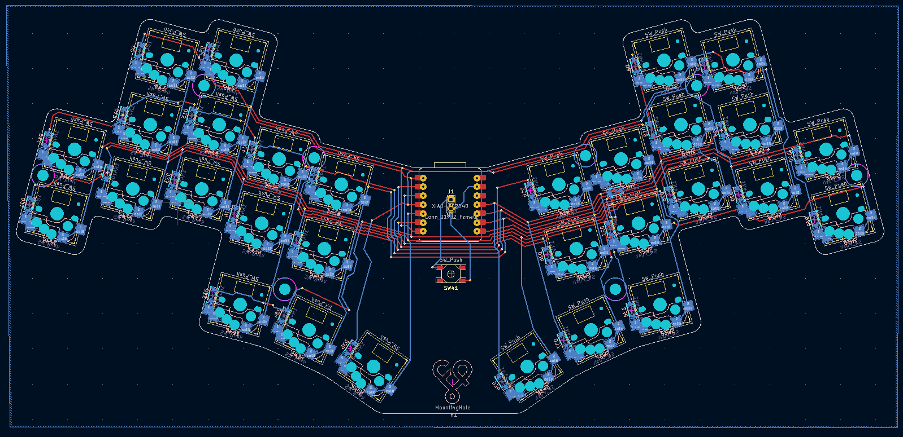
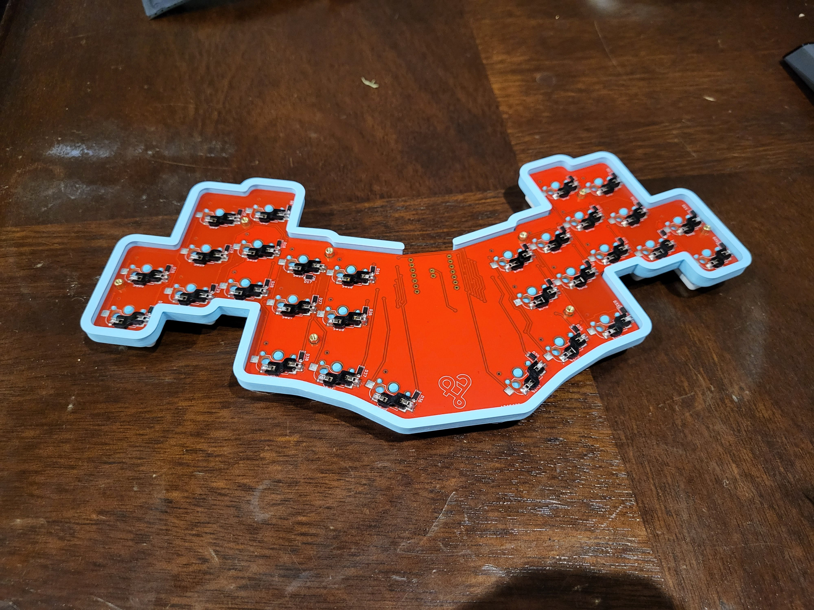
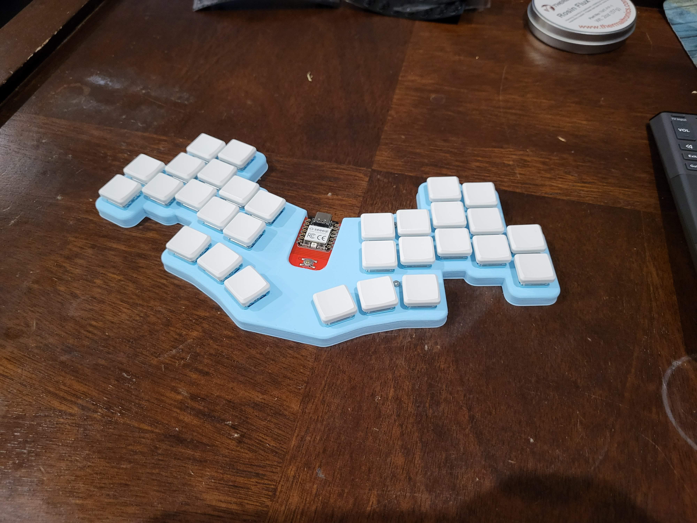
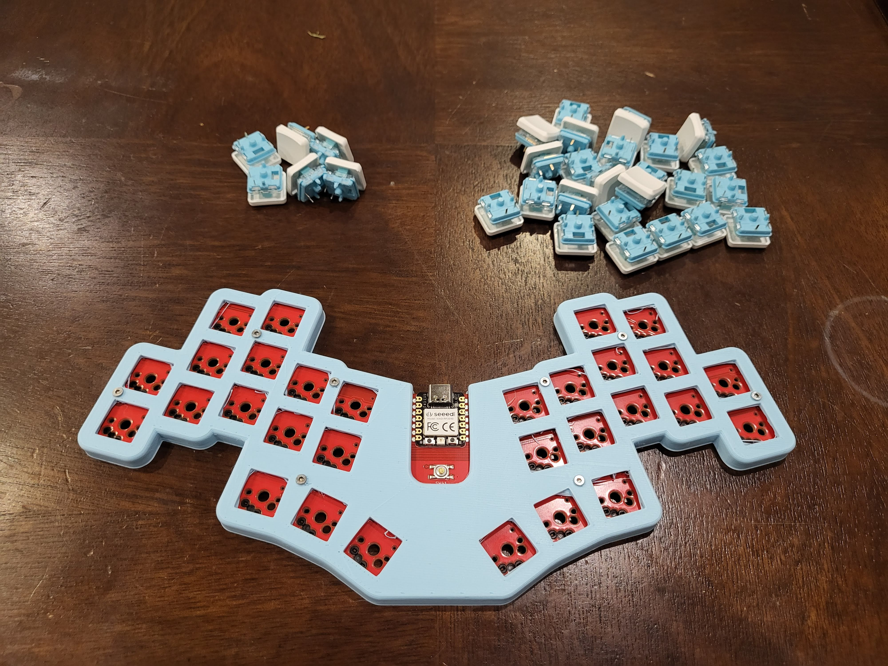

# arachnophobe

A 30 key column staggered board using the Seeed RP2040. Uses kailh hotswap and supports both Choc v1 and MX switches on the same pcb.

# Support me!

I have spent a lot of time and money designing prototypes, testing, developing, etc. Any contributions would be greatly appreciated!

If you don't want to, or can't afford to support me, please send me a message to let me know you've built one, along with pictures. Also, feel free to submit a pull request with pictures into this repository. I'd be happy to showcase your build.

Reddit: /u/sadekbaroudi
Discord: sadekbaroudi#1258

# Firmware

## QMK
[arachnophobe-qmk](https://github.com/sadekbaroudi/qmk_firmware/tree/master/keyboards/fingerpunch/arachnophobe)

Note that you may need to copy this folder into the latest develop branch (as of this writing, 2022-07-13) to get the RP2040 support in QMK.

## ZMK

[arachnophobe-zmk](https://github.com/sadekbaroudi/zmk-arachnophobe)

# Images

## PCB

## Choc build

